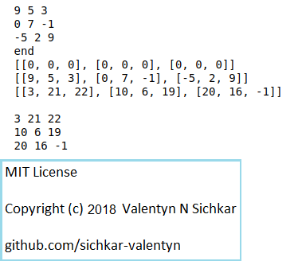

# Lists in Python as two-dimensional arrays
Examples how to create 2-dimensional lists in Python and use them as arrays

### Reference to:
[1] Valentyn N Sichkar. Lists in Python as two-dimensional arrays // GitHub platform [Electronic resource]. URL: https://github.com/sichkar-valentyn/Lists_in_Python_as_two-dimensional_arrays (date of access: XX.XX.XXXX)

## Description
How to create two 2-dimensional lists in Python with the same values and operate with them as arrays.

## 2-dimensional lists in Python

## MIT License
## Copyright (c) 2018 Valentyn N Sichkar
## github.com/sichkar-valentyn
### Reference to:
[1] Valentyn N Sichkar. Lists in Python as two-dimensional arrays // GitHub platform [Electronic resource]. URL: https://github.com/sichkar-valentyn/Lists_in_Python_as_two-dimensional_arrays (date of access: XX.XX.XXXX)
